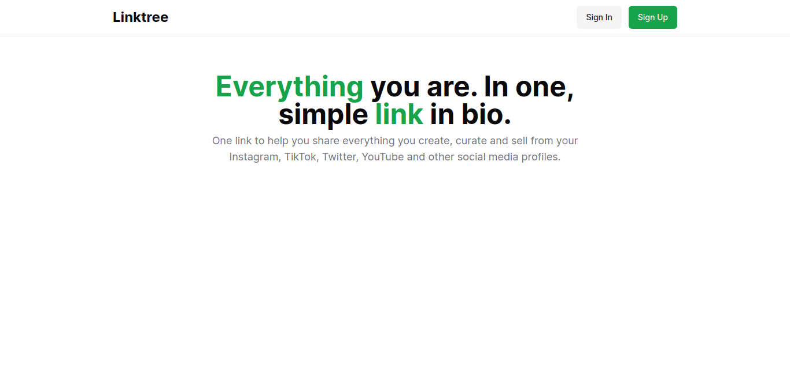
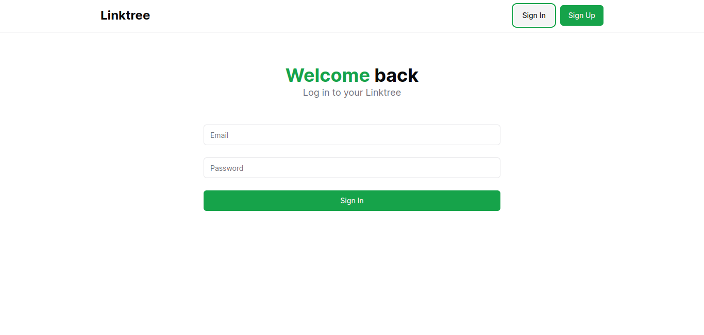
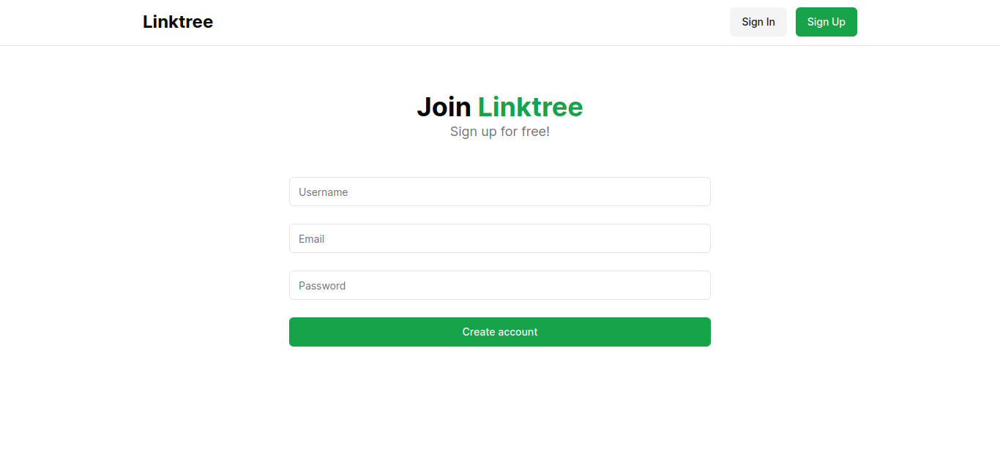
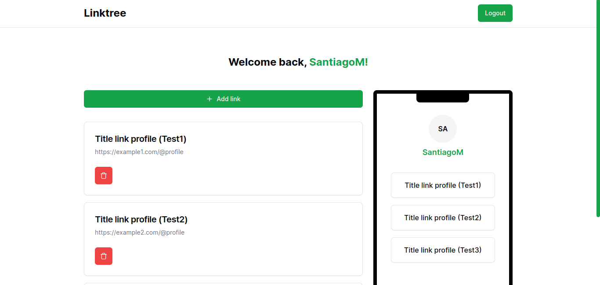
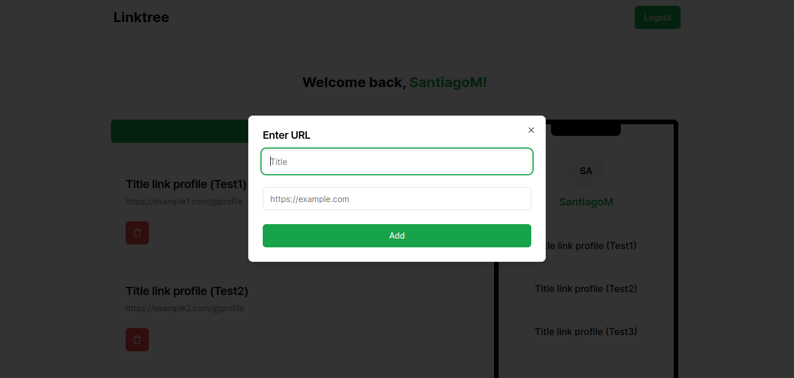
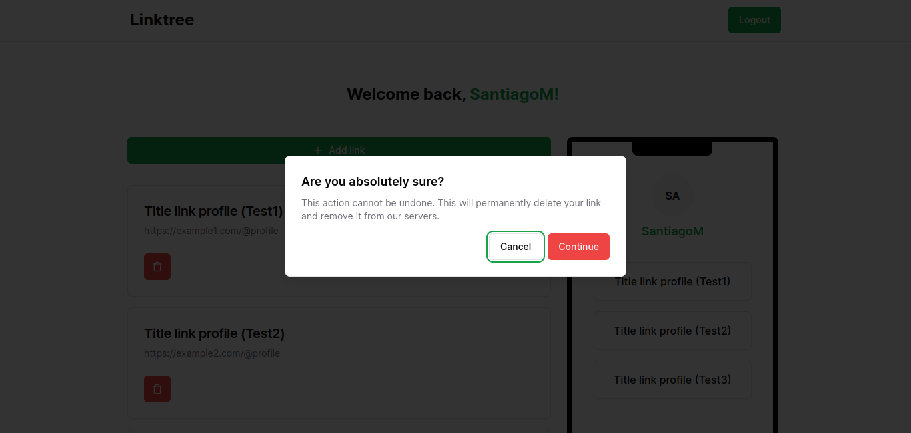

# NextJS and Prisma Linktree Clone

Linktree clone made with NextJS and prisma. Focused on the logic and the way links are created, saved and displayed in each user's profile.

## Steps to execute the project:

```shell
# 1. Clone the repository
git clone https://github.com/Remy349/nextjs-prisma-linktree.git

# 2. Moving to the project folder
cd nextjs-prisma-linktree

# 3. Install dependencies with npm
npm install

# 4. Run the project
npm run dev
```

## Technologies used for its development:

- NextJS
- Prisma
- TailwindCSS
- Axios
- ShadcnUI

## Preview images








### Developed by Santiago Moraga Caldera - Remy349
